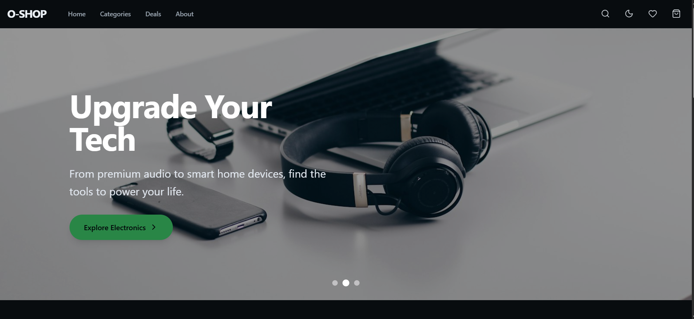
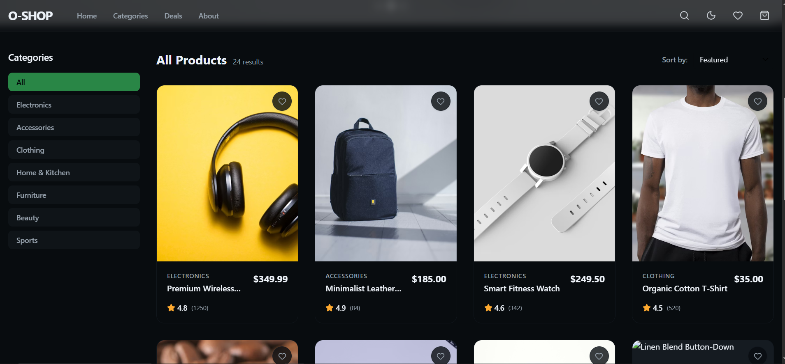

# 🛍️ O-Shop | Premium E-Commerce Frontend

O-Shop is a beautifully designed, highly interactive front-end e-commerce portfolio project showcasing modern web engineering, robust state management, and high-fidelity UI polish.

## 🚀 Live Demo

[Visit O-Shop Live](https://o-shop-one.vercel.app/)

## 🖼️ Screenshots

---

## 🛠️ Tech Stack

*   **Framework:** Next.js 15 (App Router)
*   **Library:** React 19
*   **Styling:** Tailwind CSS v4 (with custom OKLCH color palettes & Dark Mode)
*   **State Management:** Zustand (with `localStorage` persistence middleware)
*   **Animations:** Framer Motion
*   **Icons:** Lucide React
*   **Utilities:** next-themes, clsx, tailwind-merge

---

## 📚 What I Learned

Through this project, I solidified my understanding of advanced React patterns and Next.js optimization. Specifically:
1.  **Complex UI State Management:** Moving beyond simple `useState` by integrating Zustand to manage a global cart, wishlist, and optimistic Toast notifications seamlessly.
2.  **Persistent Data:** Hydrating Next.js client components from `localStorage` without triggering hydration mismatch errors.
3.  **Advanced Filtering & Search:** Leveraging `useMemo` to build performant, dynamic product grids that recompute efficiently based on active category, sort states, and real-time fuzzy search queries.
4.  **Premium Dark Mode:** Implementing a seamless light/dark theme toggle using CSS variables and `next-themes` that completely transforms the aesthetic instantly.

---

## ⚠️ Challenges Faced

1.  **Hydration Mismatches:** When building the `Navbar` cart/wishlist badges and the `CartSidebar`, Next.js SSR conflicted with initial `localStorage` reads. I solved this by implementing a `[mounted, setMounted]` hydration safeguard pattern.
2.  **Complex Micro-Animations:** Orchestrating the Cart Sidebar slide-over while dimming the background required synchronizing Framer Motion's `AnimatePresence` with the global Zustand UI state.
3.  **Tailwind v4 Setup:** Ensuring the dark mode toggle functioned correctly required migrating from standard media queries to class-based `.dark` selectors within the new Tailwind v4 structure.
4.  **Auto-Scrolling UX:** Linking the search bar and hero buttons directly to functional scroll listeners to enhance the single-page application feel without relying on anchor tags.

---

## 📈 Future Improvements

While this is currently a frontend demonstration, future iterations could include:
*   [ ] **Fullstack Integration:** Connecting the frontend to a real API (e.g., Stripe for payments, Sanity or Medusa for a headless CMS).
*   [ ] **Authentication:** Implementing NextAuth.js to allow users to save their favorite items to a persistent database profile.
*   [ ] **Dynamic Reviews:** Allowing users to leave real feedback and rating stars on individual products.
*   [ ] **Product Cross-Selling:** Adding a dynamic "Related Products" carousel at the bottom of the checkout or product details pages.
